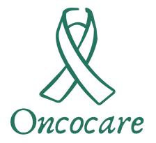

<h1 align="center">
    
</h1>

OncoCare is an application focused on the wellbeing of those who are going through an oncological process, who need care and tips to make this phase as light and calm as possible

# Table of Content

<!--ts-->

- [About](#)
- [Table of Content](#Table-of-Content)
- [Installation](#Installation)
- [Status](#Status)
- [Features](#features)
- [Technologies](#Technologies)
<!--te-->

# Installation

Clone the project and install the dependencies running the following command:

`yarn`

or

`npm install`

To run the project in Android Device:

`yarn android`

iOS:

`yarn ios`

# Status

<h4 align="center"> 
 
  🚧  In development...  🚧
</h4>
 

# Features

[x] Welcome
[x] SignIn
[x] SignUp
[ ] ForgotPassword
[ ] Feed
[ ] Profile
[ ] Backend Integration

# Technologies

There are the technologies used to build the project

- [TypeScript](https://www.typescriptlang.org/docs/)
- [React](https://pt-br.reactjs.org)
- [React Native](https://reactnative.dev/docs/getting-started)
- [React Navigation](https://reactnavigation.org/docs/getting-started/)

# Author

<a href="https://www.linkedin.com/in/feliperramos/">
  
   
  <b>Felipe Ramos</b>
</a>

Make with ❤️ by Felipe Ramos

 
